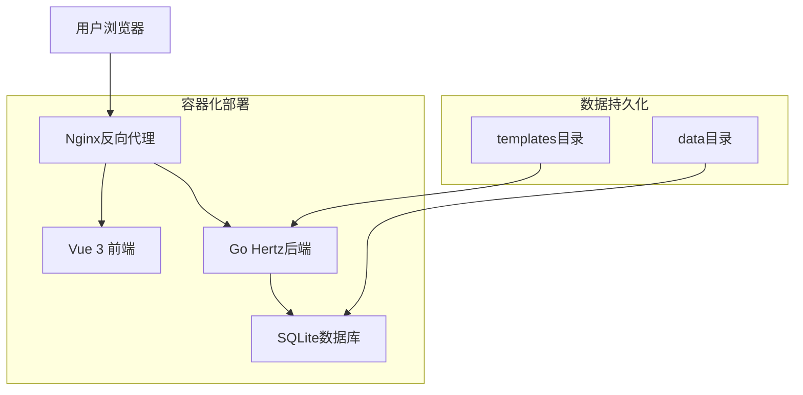

# Scaffold 项目脚手架

<p align="center">
  
  
  
  
  
</p>

现代化的全栈项目脚手架工具，一键生成包含 Vue 3 前端 + Go 后端 + Docker 部署的完整项目结构。

## 🌟 项目特色

- **🎯 全栈一体化**：集成前端、后端、数据库、部署的一站式解决方案
- **⚡ 零配置启动**：Docker Compose 一键部署，开箱即用
- **🇨🇳 中国网络优化**：内置国内镜像源，构建速度快 50%+
- **🔐 安全认证**：可选的 API 访问密钥认证机制
- **💾 数据持久化**：SQLite 外部挂载，数据安全可靠
- **🎨 现代化界面**：响应式设计，暗黑主题，流畅交互体验

## 🚀 快速开始

### 1. 克隆项目

```bash
git clone https://github.com/yi-nology/scaffold.git
cd scaffold
```

### 2. 启动服务

**开发环境：**
```bash
# 启动前端开发服务器
make dev-web

# 启动后端服务
make dev
```

**生产环境：**
```bash
# 进入部署目录
cd deploy

# 使用中国网络优化（推荐）
./deploy-cn.sh optimize
./deploy-cn.sh up

# 或标准部署
./deploy.sh up
```

### 3. 访问应用

- **Web 界面**：http://localhost:3000
- **API 文档**：http://localhost:9090/swagger
- **健康检查**：http://localhost:9090/health

## 🏗️ 技术架构



## 📁 项目结构

```
scaffold/
├── cmd/scaffold/          # CLI 命令行工具
│   ├── main.go           # 程序入口
│   └── cli.go            # 命令行接口
├── internal/              # 核心业务逻辑
│   ├── server/           # HTTP 服务
│   ├── config/           # 配置管理
│   ├── generator/        # 项目生成器
│   └── template/         # 模板引擎
├── pkg/                   # 公共组件库
│   ├── database/         # 数据库封装
│   └── zip/              # ZIP 打包工具
├── web/                   # Vue 3 前端应用
│   ├── src/              # 源代码
│   ├── public/           # 静态资源
│   └── package.json      # 前端依赖
├── deploy/                # Docker 部署配置
│   ├── backend/          # 后端 Docker 配置
│   ├── frontend/         # 前端 Docker 配置
│   ├── docker-compose.yml # 服务编排
│   └── deploy-cn.sh      # 中国网络优化脚本
├── templates/             # 项目模板
│   └── example/web/      # Web 项目示例模板
├── Makefile              # 构建脚本
└── go.mod                # Go 模块依赖
```

## 🛠️ 核心功能

### CLI 命令行工具

```bash
# 构建 CLI 工具
make build

# 使用 CLI 生成项目
./bin/scaffold init my-project --git --tidy

# 查看帮助
./bin/scaffold --help
```

### Web 图形界面

访问 http://localhost:3000 使用图形化界面：
- 🎨 模板选择和配置
- ⚙️ 项目参数设置
- 📦 一键生成和下载
- 🔄 异步模板管理

### API 接口

```bash
# 获取模板列表
curl http://localhost:9090/api/templates

# 生成项目
curl -X POST http://localhost:9090/api/generate \
  -H "Content-Type: application/json" \
  -d '{"template_id":"web","config":{"project_name":"my-app"}}'

# 下载生成的项目
curl http://localhost:9090/api/download/{task_id} -o project.zip
```

## 🔧 开发环境搭建

### 前置要求

- Go 1.21+
- Node.js 18+
- Docker 20.10+（可选，用于部署测试）

### 本地开发

```bash
# 安装依赖
make install

# 启动前端开发服务器
make dev-web
# 访问 http://localhost:3000

# 启动后端服务
make dev
# API 服务运行在 http://localhost:9090

# 构建项目
make build
```

### 代码质量

```bash
# 运行测试
make test

# 代码格式化
make fmt

# 静态检查
make vet
```

## 🐳 Docker 部署

### 标准部署

```bash
cd deploy
./deploy.sh up
```

### 中国网络优化部署

```bash
cd deploy
./deploy-cn.sh optimize  # 首次运行配置镜像源
./deploy-cn.sh up        # 启动服务
```

### 环境变量配置

创建 `deploy/.env` 文件：

```bash
# ===== 服务端口 =====
FRONTEND_PORT=80
BACKEND_PORT=9090

# ===== 服务器配置 =====
PORT=9090
HOST=0.0.0.0
CACHE_DIR=./cache
DEBUG=false

# ===== 安全配置 =====
ACCESS_KEY=your-secret-key  # API 访问密钥（可选）

# ===== 数据库配置 =====
DB_ENABLE=true
DB_DRIVER=sqlite
DB_NAME=./data/scaffold.db

# ===== 日志配置 =====
LOG_LEVEL=info
LOG_FORMAT=text

# ===== 应用设置 =====
TZ=Asia/Shanghai
```

## 🔐 安全特性

### API 认证

支持可选的访问密钥认证：

```bash
# 启用认证
export ACCESS_KEY=your-secure-key

# API 请求（带认证）
curl -H "Authorization: Bearer your-secure-key" \
     http://localhost:9090/api/templates
```

### 容器安全

- 使用非 root 用户运行容器
- 启用健康检查机制
- 网络隔离和端口限制
- 定期安全更新

## 📊 监控与维护

### 服务状态

```bash
# 查看服务状态
docker-compose ps

# 查看实时日志
docker-compose logs -f

# 查看资源使用
docker stats
```

### 数据管理

```bash
# 备份数据库
cp deploy/data/scaffold.db deploy/data/scaffold_backup.db

# 查看数据库内容
sqlite3 deploy/data/scaffold.db

# 管理模板文件
ls deploy/templates/
```

## 🌍 中国网络优化

针对中国开发者特别优化：

### 镜像源加速
- **Docker Hub**：阿里云、网易、中科大镜像源
- **Go Modules**：goproxy.cn 国内代理
- **NPM**：npmmirror.com 淘宝镜像
- **Alpine Packages**：阿里云镜像源

### 构建优化
```bash
# 使用优化脚本
./deploy-cn.sh optimize  # 配置镜像源
./deploy-cn.sh rebuild   # 快速构建
```

## 🤝 贡献指南

欢迎参与项目开发！

### 开发流程

1. Fork 项目
2. 创建特性分支 (`git checkout -b feature/AmazingFeature`)
3. 提交更改 (`git commit -m 'Add some AmazingFeature'`)
4. 推送到分支 (`git push origin feature/AmazingFeature`)
5. 开启 Pull Request

### 代码规范

- Go 代码遵循 [Effective Go](https://golang.org/doc/effective_go.html)
- Vue 代码使用 ESLint + Prettier
- 提交信息使用 conventional commits 格式

## 📈 性能基准

| 场景 | 标准构建 | 优化构建 | 提升幅度 |
|------|----------|----------|----------|
| 首次构建 | ~300s | ~150s | 50% |
| 增量构建 | ~60s | ~30s | 50% |
| 镜像大小 | 180MB | 120MB | 33% |

## 📄 许可证

本项目采用 MIT 许可证 - 查看 [LICENSE](LICENSE) 文件了解详情

## 🙏 致谢

感谢以下开源项目的贡献：

- [Vue.js](https://vuejs.org/) - 前端框架
- [Go](https://golang.org/) - 后端语言
- [Hertz](https://github.com/cloudwego/hertz) - HTTP 框架
- [Docker](https://www.docker.com/) - 容器化平台
- [SQLite](https://www.sqlite.org/) - 嵌入式数据库

## 📞 联系方式

- **项目主页**：[https://github.com/yi-nology/scaffold](https://github.com/yi-nology/scaffold)
- **问题反馈**：[Issues](https://github.com/yi-nology/scaffold/issues)
- **功能讨论**：[Discussions](https://github.com/yi-nology/scaffold/discussions)
- **贡献代码**：[Pull Requests](https://github.com/yi-nology/scaffold/pulls)

---
<p align="center">
  Made with ❤️ by <a href="https://github.com/yi-nology">yi-nology</a>
</p>
